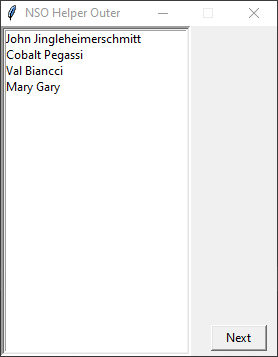
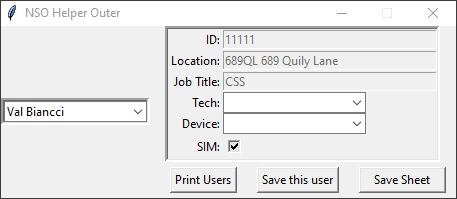

# NSO Helper
 
Small python application for semi-automating the creation of a weekly spreadsheet
 
Uses tkinter for GUI and openpyxl for Excel stuff

## Building Project
I have been using pyinstaller for building an exe file. Windows Defender can think pyinstaller packages are viruses, so building it yourself can feel safer.
I have included an excel file with some sample input to see how the program is intended to function.

### Command to build executable
pyinstaller --noconsole --onefile NSO_GUI.py
